# Seabird At-Sea Spatial Distribution Evidence Dossier

## **Background**

At-sea spatial distribution information for seabirds is essential for understanding species exposure to offshore wind energy development. Species distribution models are a powerful tool for estimating regional patterns of occurrence, but are data intensive and therefore difficult to develop in data-limited regions or for rare or cryptic species.

**For this portion of the elicitation workshop, please consider the following scenario:**

*Our team is estimating seabird exposure to offshore wind energy development off the coast of California. To do this, we are using a dataset of at-sea spatial distributions for seabirds on the outer continental shelf of California, Oregon, and Washington. These distributions were produced using species distribution models that link marine bird survey data with environmental and oceanographic covariates (Leirness et al., 2021). The original study produced seasonal distribution models, which we have averaged to generate estimates of year-round spatial use.*

*Six seabird species of interest were not observed in sufficient numbers during at-sea surveys to support the development of distribution models. We are therefore asking you to use your knowledge of seabird life history and habitat use to estimate the distribution of these species within the region. To ensure a common baseline of information between expert respondents, we have compiled the most relevant available information on spatial ecology for these species, or for closely related species when species-specific information was unavailable. Please review this background information before providing your responses.*

We recognize that some participants may already be familiar with the results of the reference study. This does not preclude participation; however, to reduce the influence of potential past exposure to the blinded data on your responses, **please refrain from directly consulting or reviewing the reference dataset (Leirness et al., 2021) when reviewing this dossier or providing your survey responses**.

Leirness, Jeffery B, Josh Adams, Lisa T Ballance, et al. *Modeling At-Sea Density of Marine Birds to Support Renewable Energy Planning on the Pacific Outer Continental Shelf of the Contiguous United States*. OCS Study BOEM 2021-014. US Department of the Interior, Bureau of Ocean Energy Management, 2021.

## **Pomarine Jaeger**

### Regional Distribution, Habitat and Movement Information from Birds of the World 

*Source: Haven Wiley, R. and D. S. Lee (2020). Pomarine Jaeger (Stercorarius pomarinus), version 1.0. In Birds of the World (S. M. Billerman, Editor). Cornell Lab of Ornithology, Ithaca, NY, USA. <https://doi.org/10.2173/bow.pomjae.01>*

#### Distribution (Wintering)

"Winters from California to Peru ([Bent 1921](https://birdsoftheworld-org.us1.proxy.openathens.net/bow/species/pomjae/cur/references#REF56699), [Murphy 1936](https://birdsoftheworld-org.us1.proxy.openathens.net/bow/species/pomjae/cur/references#REF60349), [Cramp 1985a](https://birdsoftheworld-org.us1.proxy.openathens.net/bow/species/pomjae/cur/references#REF4571)), although no reports of large numbers in this area; occasional as far north as central California in winter, the only jaeger regularly present then ([Briggs et al. 1987b](https://birdsoftheworld-org.us1.proxy.openathens.net/bow/species/pomjae/cur/references#REF7839), [Stallcup 1990](https://birdsoftheworld-org.us1.proxy.openathens.net/bow/species/pomjae/cur/references#REF59340))."

"Off Washington State, 93% observed \>10 km from shore. Off n. California in Sep when numbers of migrants reach a peak, most are seaward of continental shelf; in Oct, as overall numbers decrease, center of density shifts to continental shelf; few birds occur in central axis of California Current 200-500 km offshore ([Briggs et al. 1987b](https://birdsoftheworld-org.us1.proxy.openathens.net/bow/species/pomjae/cur/references#REF7839)). Off Monterey, central California, migrants prefer the zone 3-80 km from shore near concentrations of shearwaters ([Stallcup 1990](https://birdsoftheworld-org.us1.proxy.openathens.net/bow/species/pomjae/cur/references#REF59340)). Off s. California in Oct, most numerous over the outer continental shelf ([Briggs et al. 1987b](https://birdsoftheworld-org.us1.proxy.openathens.net/bow/species/pomjae/cur/references#REF7839)).”

#### Migration (South of breeding)

"Off Washington and California, the most numerous jaeger in autumn. Off Washington occurs from mid-Jul to mid-Oct, observed on 97% of trips offshore in Aug and Sep; also present in May ([Wahl 1975](https://birdsoftheworld-org.us1.proxy.openathens.net/bow/species/pomjae/cur/references#REF6176)). Off California numerous from mid-Aug into Nov; highest numbers in late Sep and Oct, when 30,000-70,000 estimated in California waters ([Briggs et al. 1987b](https://birdsoftheworld-org.us1.proxy.openathens.net/bow/species/pomjae/cur/references#REF7839)). Off Monterey, central California, migrants pass between mid-Jul and mid-Nov and from mid-Apr through May; prefer the zone 3-80 km from shore near concentrations of shearwaters ([Stallcup 1990](https://birdsoftheworld-org.us1.proxy.openathens.net/bow/species/pomjae/cur/references#REF59340)). Occupies most of Southern California Bight by mid-Sep, reaching maximal numbers in Oct; most numerous over outer continental shelf, near underwater ridge between Santa Rosa I. and Cortés Bank, about 150 km southwest of Los Angeles ([Briggs et al. 1987b](https://birdsoftheworld-org.us1.proxy.openathens.net/bow/species/pomjae/cur/references#REF7839)). In Oct, 1.5-3.6 birds/h reported over continental shelf off s. California; less numerous (\<1 bird/h) beyond the shelf ([Jehl 1973b](https://birdsoftheworld-org.us1.proxy.openathens.net/bow/species/pomjae/cur/references#REF45425))."

#### Migration (Behavior)

“Migrants accompany flocks of shearwaters in Pacific Ocean ([Austin and Kuroda 1953](https://birdsoftheworld.org/bow/species/pomjae/1.0/references#REF3160)).”

### Range Map

*Source: [Birdlife International Data Zone](https://datazone.birdlife.org/species/factsheet/pomarine-jaeger-stercorarius-pomarinus)*

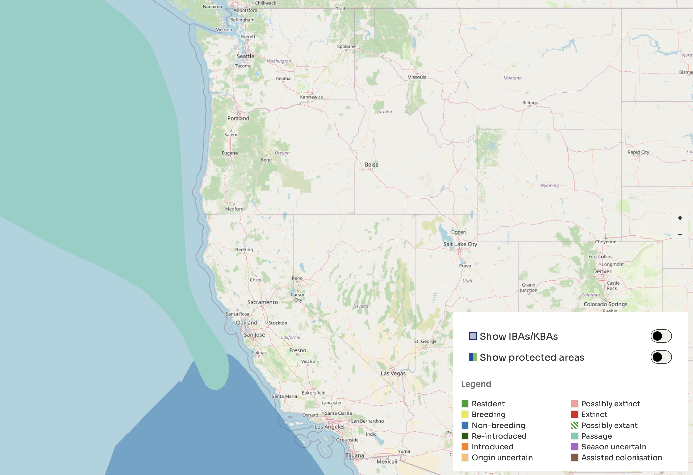*\
*

### Range Map

*Source: [eBird](https://ebird.org/species/pomjae)*

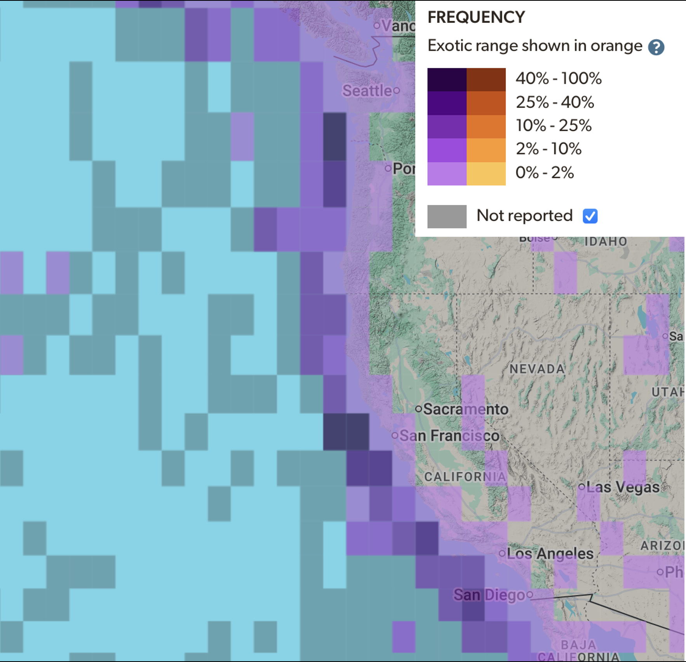*\
*

## **Cassin’s Auklet**

### Range Map

*Source: [Birdlife International Data Zone](https://datazone.birdlife.org/species/factsheet/cassins-auklet-ptychoramphus-aleuticus)*

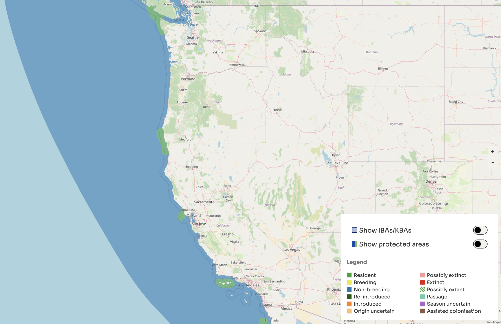

### Range Map

*Source: [eBird](https://ebird.org/species/casauk)*

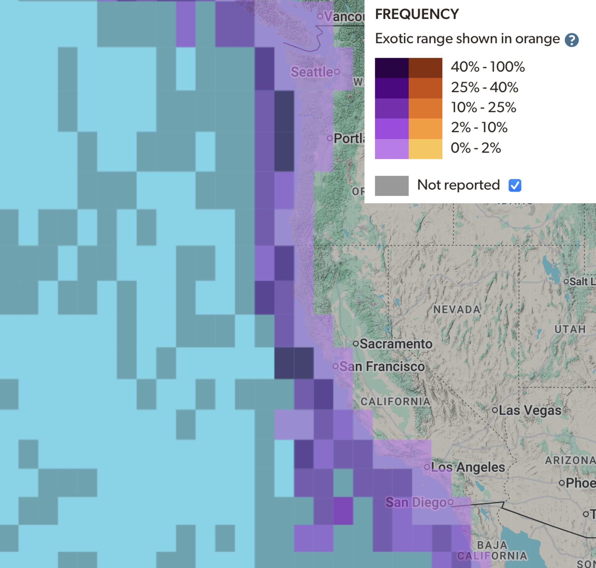

## **Northern Fulmar**

### Range Map

*Source: [Birdlife International Data Zone](https://datazone.birdlife.org/species/factsheet/northern-fulmar-fulmarus-glacialis)*

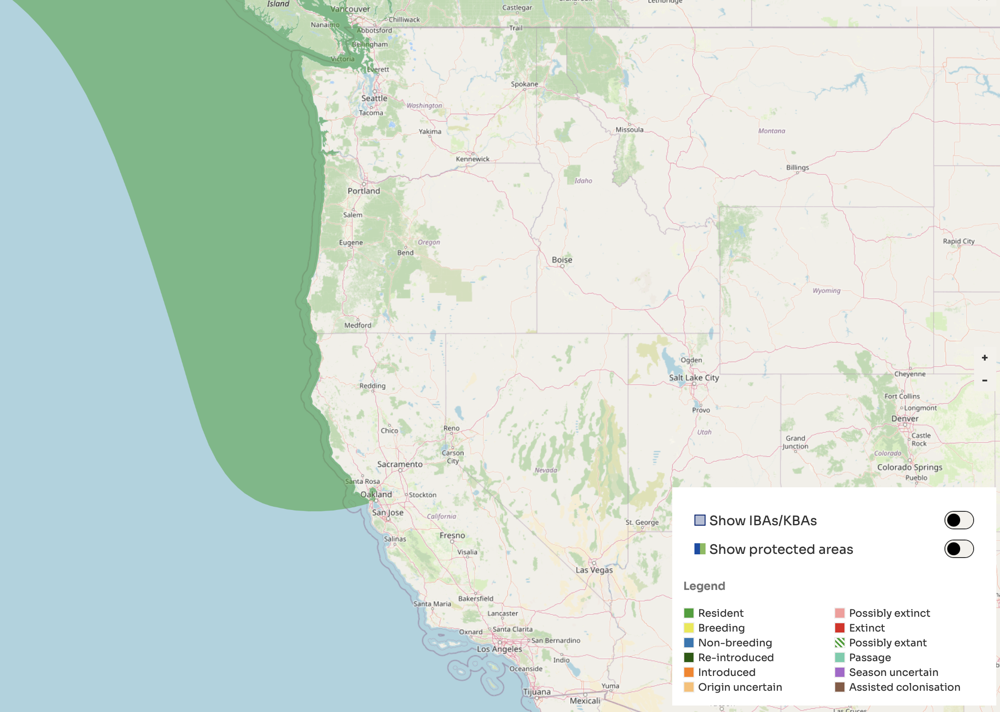

### Range Map

*Source: [eBird](https://ebird.org/species/norful)*

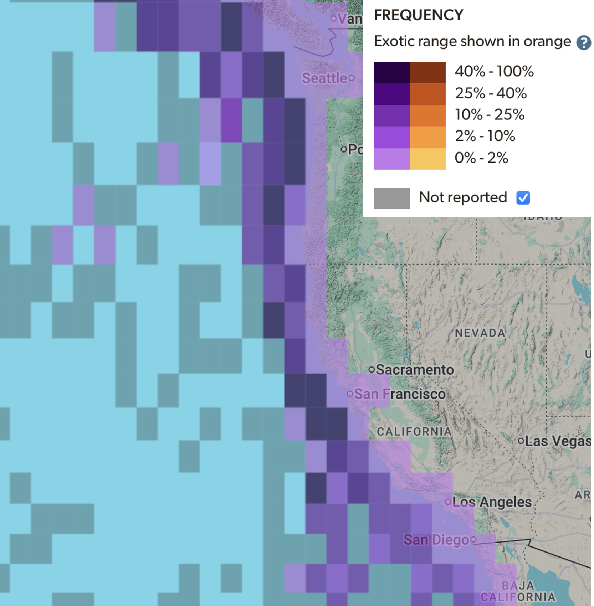

## **Black-Legged Kittiwake**

### Range Map

*Source: [Birdlife International Data Zone](https://datazone.birdlife.org/species/factsheet/black-legged-kittiwake-rissa-tridactyla)*

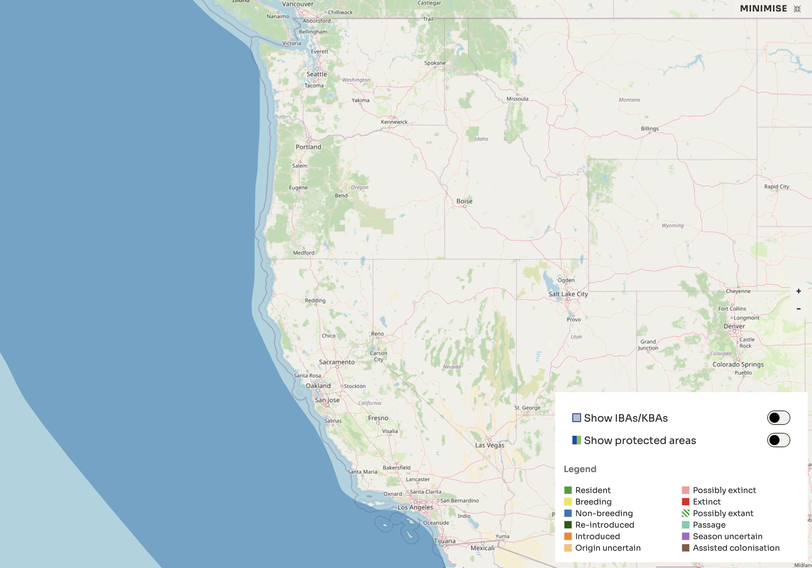

### Range Map

*Source: [eBird](https://ebird.org/species/bklkit)*

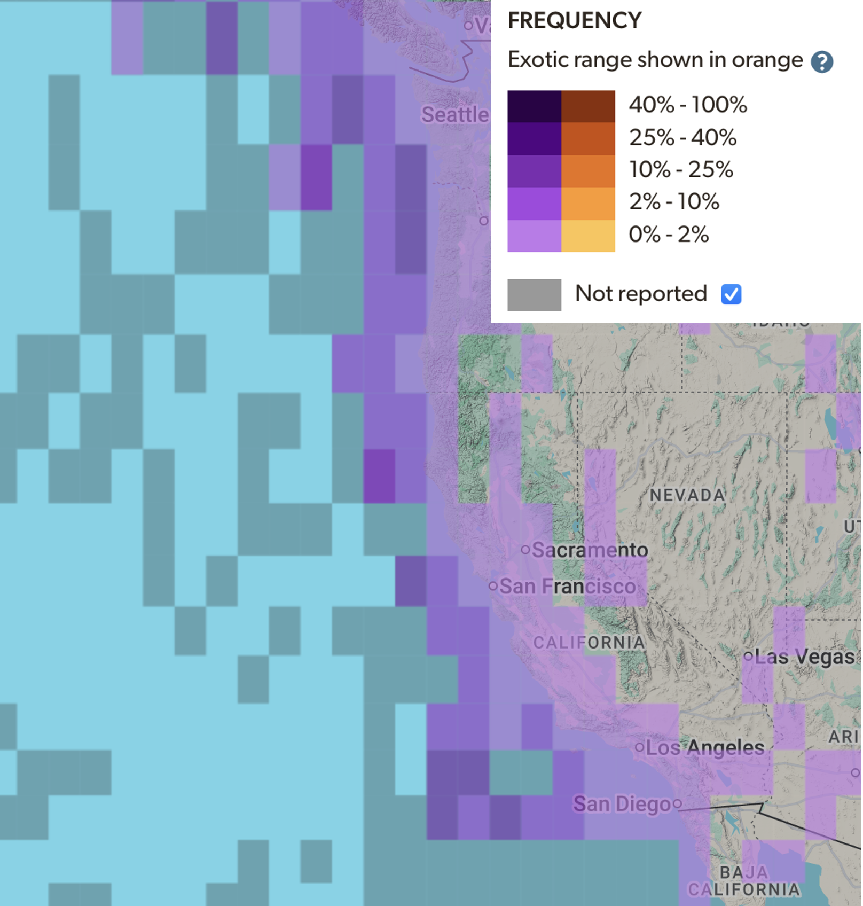

## **Laysan Albatross**

### Range Map

*Source: [Birdlife International Data Zone](https://datazone.birdlife.org/species/factsheet/laysan-albatross-phoebastria-immutabilis)*

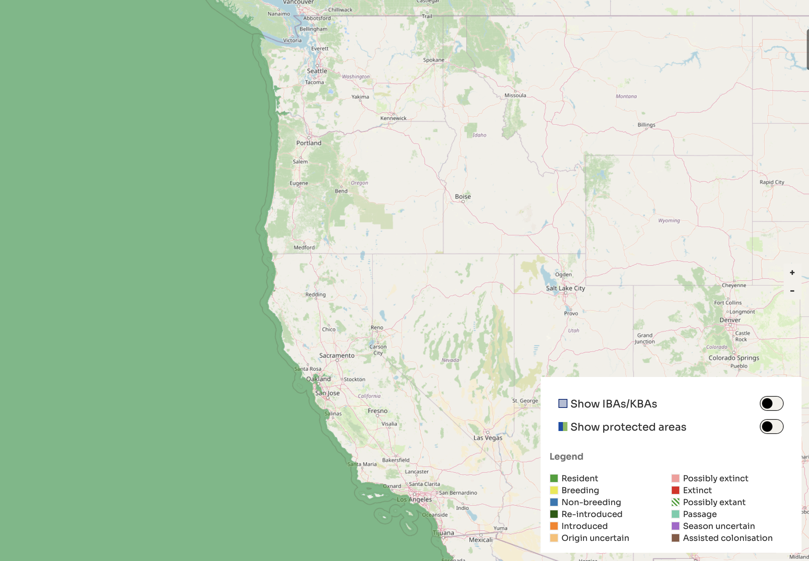

### Range Map

*Source: [eBird](https://ebird.org/species/layalb)*

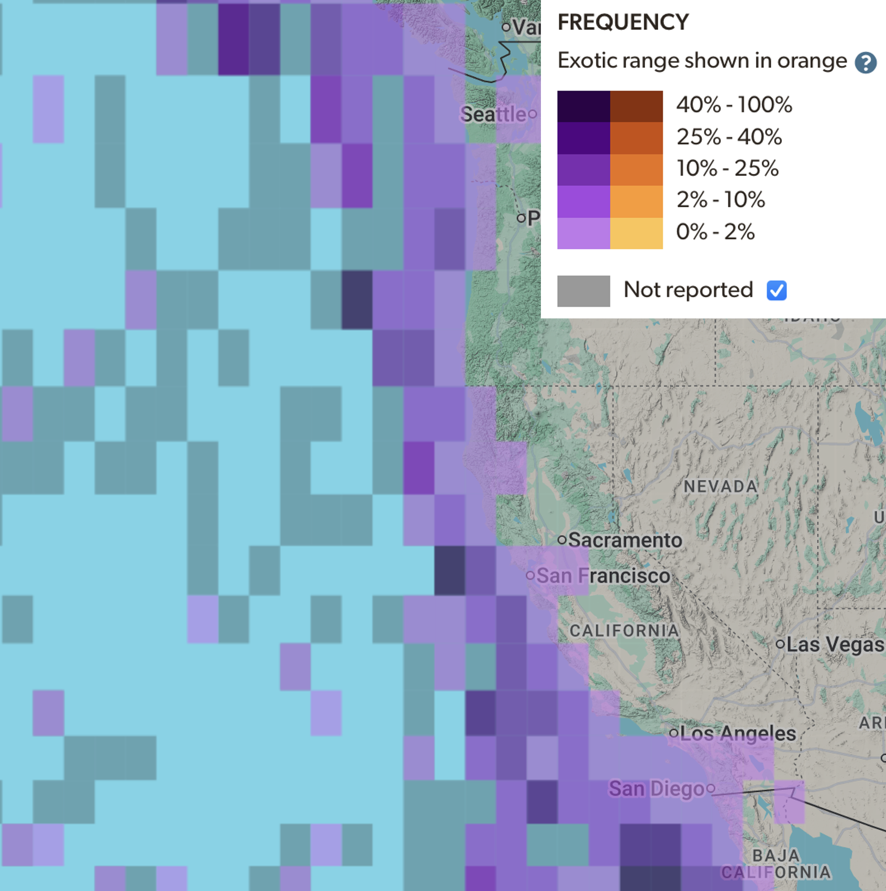

## **Ashy Storm Petrel**

### Range Map

*Source: [Birdlife International Data Zone](https://datazone.birdlife.org/species/factsheet/ashy-storm-petrel-hydrobates-homochroa)*

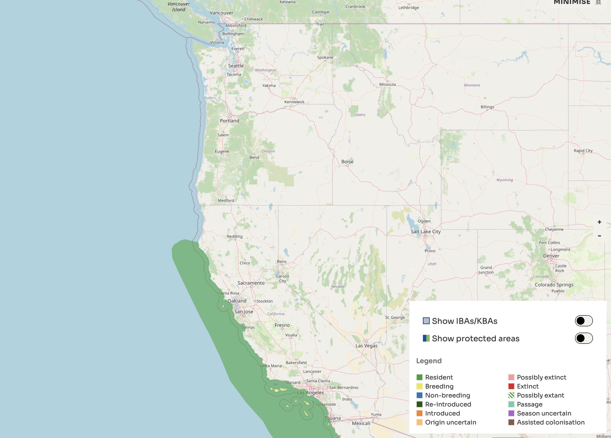

### Range Map

*Source: [eBird](https://ebird.org/species/asspet)*
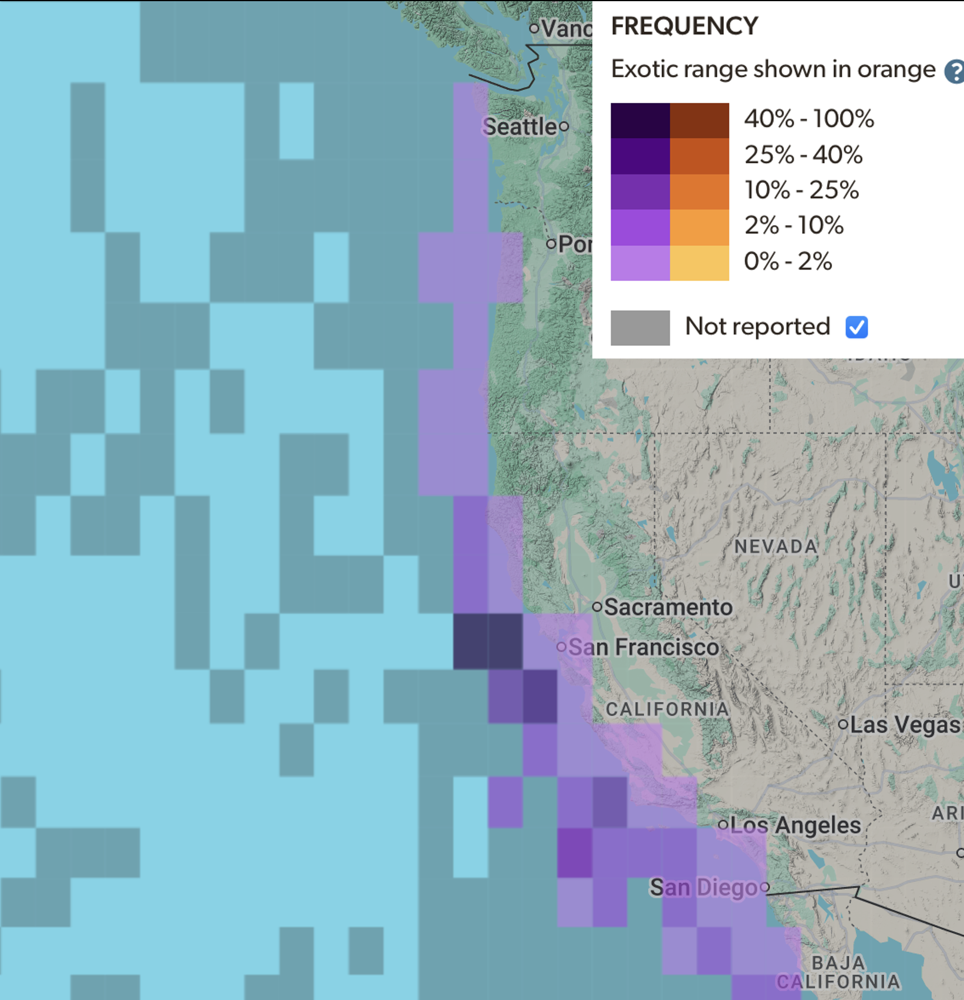

\
